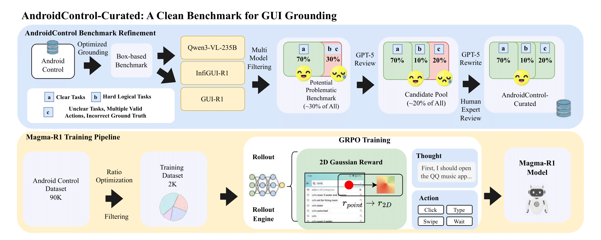

<h1 align="center">
  
  <br>
  AndroidControl-Curated: Revealing the True Potential of GUI Agents through Benchmark Purification
</h1>

<p align="center">
  <a href="https://arxiv.org/abs/2510.18488v1"></a>
  <a href="https://huggingface.co/datasets/batwBMW/AndroidControl_Curated"></a>
  <a href="https://huggingface.co/batwBMW/Magma-R1"></a>
</p>

<br>
<p align="center">
  <strong>This is the official repository for the paper <a href="https://github.com/batechworks/AndroidControl_Curated">AndroidControl-Curated</a>.</strong>
</p>

## 🌟 Overview

On-device virtual assistants like Siri and Google Assistant are increasingly pivotal, yet their capabilities are hamstrung by a reliance on rigid, developer-dependent APIs. GUI agents offer a powerful, API-independent alternative, but their adoption is hindered by the perception of poor performance, as ~3B parameter models score as low as 60% on benchmarks like AndroidControl, far from viability for real-world use.

Our research reveals that issue lies not only with the models but with the benchmarks themselves. We identified notable shortcomings in AndroidControl, including ambiguities and factual errors, which systematically underrates agent capabilities. To address this critical oversight, we enhanced AndroidControl into **AndroidControl-Curated**, a refined version of the benchmark improved through a rigorous purification pipeline. 

On this enhanced benchmark, state-of-the-art models achieve success rates nearing 80% on complex tasks, reflecting that on-device GUI agents are actually closer to practical deployment than previously thought. We also trained our new SOTA model, **Magma-R1**, on just 2,400 curated samples, which matches the performance of previous models trained on over 31,000 samples.

<div align="center">
  
  <p><i>Overview of our integrated pipeline for Magma-R1 training and AndroidControl-Curated creation.</i></p>
</div>

## 🔥 News
- 🔥 ***`2025/10/21`*** Our paper "[AndroidControl-Curated: Revealing the True Potential of GUI Agents through Benchmark Purification](https://arxiv.org/abs/2510.18488v1)" released.

## 🚀 Updates
- ***`2025/10/21`*** The source code for `AndroidControl-Curated` and `Magma-R1` has been released.

## 📊 Results

### Table 1. Performance comparison of GUI agents on AndroidControl-Curated
*Grounding Accuracy (GA) for all models is evaluated using our proposed E_bbox. The best results are in **bold**, and the second best are <u>underlined</u>. "-" indicates results to be added.*

| Model | AndroidControl-Curated-Easy ||| AndroidControl-Curated-Hard |||
| :--- | :---: | :---: | :---: | :---: | :---: | :---: |
|| Type (%) | Grounding (%) | SR (%) | Type (%) | Grounding (%) | SR (%) |
| ***Proprietary Models*** | | | | | | |
| GPT-4o | 74.3 | 0.0 | 19.4 | 66.3 | 0.0 | 20.8 |
| ***Open-source Models*** | | | | | | |
| OS-Atlas-4B | **91.9** | 83.8 | 80.6 | 84.7 | 73.8 | 67.5 |
| UI-R1 | 62.2 | 93.6 | 58.9 | 54.4 | 79.3 | 43.6 |
| GUI-R1-3B | 69.5 | <u>94.7</u> | 67.1 | 63.1 | 80.3 | 54.4 |
| GUI-R1-7B | 74.9 | **95.9** | 72.7 | 66.5 | 82.6 | 57.5 |
| Infi-GUI-R1 (trained on 31k origin data) | 90.2 | 93.7 | <u>87.2</u> | 78.5 | 72.8 | 70.7 |
| Qwen3-VL-30B | 82.8 | 80.7 | 70.5 | <u>85.9</u> | 78.9 | 70.0 |
| Qwen3-VL-235B | 85.1 | 82.9 | 74.5 | **88.2** | <u>83.6</u> | **76.5** |
| ***Ours*** | | | | | | |
| Magma-R1 | <u>91.3</u> | 94.2 | **88.0** | <u>84.2</u> | **84.8** | <u>75.3</u> |

### Table 2. Ablation analysis of the benchmark purification process on the Hard subset
*SR Impr. (G) shows the SR gain from AndroidControl to AndroidControl-Curated-Box. SR Impr. (T) shows the SR gain from AndroidControl-Curated-Box to the final AndroidControl-Curated. Best results are in **bold**, second best are <u>underlined</u>.*

| Model | AndroidControl ||| AndroidControl-Curated-Box |||| AndroidControl-Curated ||||
| :--- | :---: | :---: | :---: | :---: | :---: | :---: | :---: | :---: | :---: | :---: | :---: |
|| Type (%) | Grounding (%) | SR (%) | Type (%) | Grounding (%) | SR (%) | SR Impr. (G) | Type (%) | Grounding (%) | SR (%) | SR Impr. (T) |
| GUI-R1-3B | 57.2 | 59.0 | 41.5 | 59.3 | 74.0 | 49.4 | +7.9 | 63.1 | 80.3 | 54.4 | +5.0 |
| GUI-R1-7B | 62.5 | 65.1 | 46.3 | 63.3 | 76.9 | 53.2 | +6.9 | 66.5 | 82.6 | 57.5 | +4.3 |
| Infi-GUI-R1 | <u>77.0</u> | 57.0 | <u>59.0</u> | 77.7 | 69.5 | 67.6 | +8.6 | 78.5 | 72.8 | 70.7 | +3.1 |
| Qwen3-VL-235B | 67.3 | **78.3** | **61.2** | **82.9** | **79.9** | **71.7** | +10.5 | **88.2** | <u>83.6</u> | **76.5** | +4.8 |
| Magma-R1 | **78.2** | 58.2 | 57.6 | <u>80.0</u> | <u>77.1</u> | <u>69.1</u> | **+11.5** | <u>84.2</u> | **84.8** | <u>75.3</u> | **+6.2** |

## 🚀 Setup & Installation

1.  **Clone the repository:**
    ```bash
    git clone https://github.com/batechworks/AndroidControl_Curated.git
    cd YourRepoName
    ```

2.  **Install dependencies:**
    We recommend using a virtual environment (e.g., conda or venv).
    ```bash
    pip install -r requirement.py
    ```

## 🧪 Evaluation

To reproduce the results on `AndroidControl-Curated`:

1.  **Download the benchmark data:**
    Download the processed test set from [Hugging Face](YOUR_HUGGINGFACE_DATASET_LINK) and place it in the `benchmark_resource/` directory. The directory should contain the following files:
    - `android_control_high_bbox.json`
    - `android_control_high_point.json`
    - `android_control_low_bbox.json`
    - `android_control_low_point.json`
    - `android_control_high_task-improved.json`

2.  **Download the model:**
    Download the `Magma-R1` model weights from [Hugging Face](YOUR_HUGGINGFACE_MODEL_LINK) and place them in your desired location.

3.  **Run the evaluation script:**
    Execute the following command, making sure to update the paths to your model and the benchmark image directory.
    ```bash
    python eval/evaluate_actions_androidControl_vllm.py \
      --model_path /path/to/your/Magma-R1-model \
      --save_name Your_Results.xlsx \
      --image_dir /path/to/your/benchmark_images_directory
    ```

## 🛠️ Methodology

Our methodology consists of two main parts:

### Systematic Benchmark Purification: The AndroidControl-Curated Pipeline

1. **Stage 1: From Coordinate Matching to Intent Alignment in Grounding Evaluation**
   - Replace overly strict point-based matching with bounding-box-based intent alignment
   - Evaluate whether predicted points fall within target UI element bounding boxes

2. **Stage 2: Task-Level Correction via LLM-Human Collaboration**
   - High-risk sample identification via execution consensus failure
   - Automated causal attribution and correction with LLMs
   - Rigorous human expert verification

### Training Paradigm of Magma-R1: Optimization via GRPO

- **Dense Rewards**: Gaussian kernel-based grounding reward for continuous feedback
- **Balanced Learning**: Action type proportional optimization to address class imbalance
- **Efficient Training**: Generative REINFORCE with Policy Optimization (GRPO)

## 📚 Citation Information

If you find this work useful, a citation to the following paper would be appreciated:

```bibtex
@article{leung2025androidcontrolcurated,
  title={AndroidControl-Curated: Revealing the True Potential of GUI Agents through Benchmark Purification},
  author={LEUNG Ho Fai (Kevin) and XI XiaoYan (Sibyl) and ZUO Fei (Eric)},
  journal={arXiv preprint arXiv:XXXX.XXXXX},
  year={2025},
  institution={BMW ArcherMind Information Technology Co. Ltd. (BA TechWorks)}
}
```

## 🙏 Acknowledgments

We thank the anonymous reviewers for their valuable feedback and suggestions. This work was made possible by the generous support of several organizations. We extend our sincere gratitude to ArcherMind for providing the high-performance computing resources essential for our experiments. We would also like to acknowledge the BMW Group for their significant administrative support. Furthermore, we are grateful to BA Techworks for invaluable technical support and collaboration throughout this project.
